# CSS-Gallery

1. 웹사이트 제작에 필요한 CSS 작성
2. 모든 CSS는 Pull requests를 통하여 작성하였기 때문에 참고 가능

## 1.  OverlappingImage
- 작성일자 : 2022-04-26
- PR Link : https://github.com/eovhdnjawm1/CSS-Gallery/pull/1
- Colum
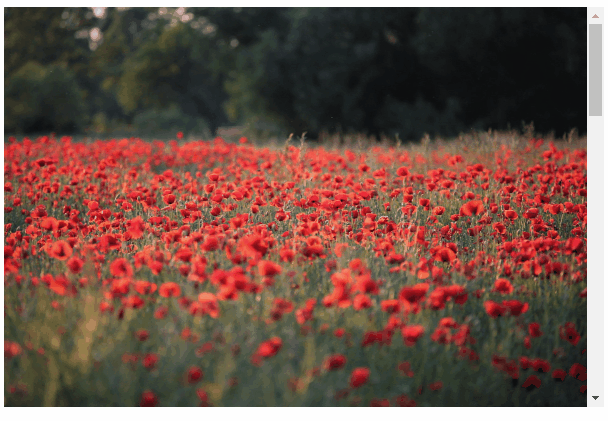
- Low


## 2. ButtonFilter
- 작성일자 : 2022-04-26
- PR Link : https://github.com/eovhdnjawm1/CSS-Gallery/pull/2
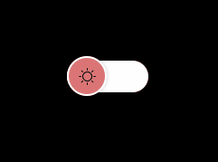

## 3. VideoText
- 작성일자 : 2022-04-27
- PR Link : https://github.com/eovhdnjawm1/CSS-Gallery/pull/3


## 4. Loading Bar
- 작성일자 : 2022-04-28
- PR Link : https://github.com/eovhdnjawm1/CSS-Gallery/pull/4
- background-color none

- background-color

- keyframes Change ver.


## 5. Link Hover Animation
- 작성일자 : 2022-04-29
- PR Link : https://github.com/eovhdnjawm1/CSS-Gallery/pull/5
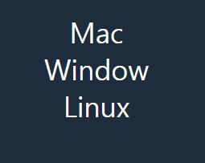

## 6. Image Color Up
- 작성일자 : 2022-04-29
- PR Link : https://github.com/eovhdnjawm1/CSS-Gallery/pull/6
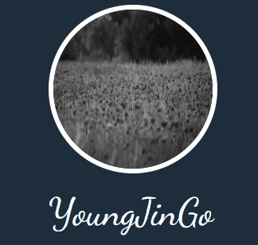

## 7. 3D Card Animation
- 작성일자 : 2022-04-30
- PR Link : https://github.com/eovhdnjawm1/CSS-Gallery/pull/7
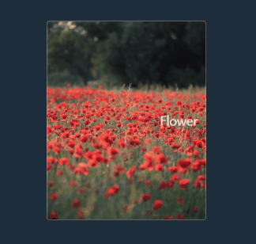


## 8. 3D Flip Card Animation
- 작성일자 : 2022-05-01
- PR Link : https://github.com/eovhdnjawm1/CSS-Gallery/pull/8
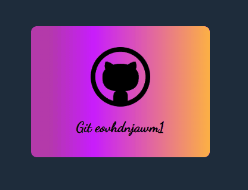


## 9. Nav Menus 
- 작성일자 : 2022-05-02
- PR Link : https://github.com/eovhdnjawm1/CSS-Gallery/pull/9
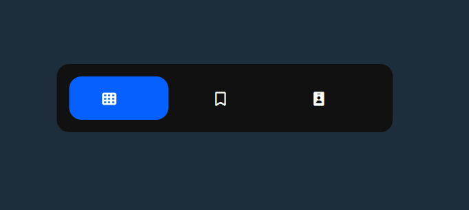

## 10. Change Figure
- 작성일자 : 2022-05-03
- PR Link : https://github.com/eovhdnjawm1/CSS-Gallery/pull/10
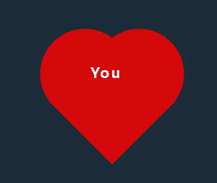

## 11. Hover Card Ani
- 작성일자 : 2022-05-04
- PR Link : https://github.com/eovhdnjawm1/CSS-Gallery/pull/11
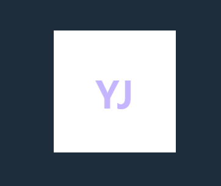

## 12. Skew Button Animation
- 작성일자 : 2022-05-05
- PR Link : https://github.com/eovhdnjawm1/CSS-Gallery/pull/12
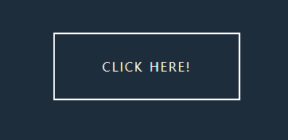

## 13. Hover Effect 
- 작성일자 : 2022-05-06
- PR Link : https://github.com/eovhdnjawm1/CSS-Gallery/pull/13
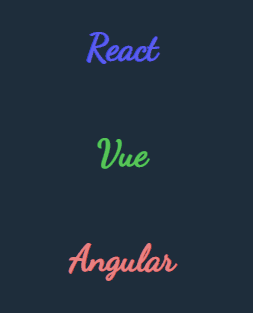

## 14. Button Hover Animation
- 작성일자 : 2022-05-07
- PR Link : https://github.com/eovhdnjawm1/CSS-Gallery/pull/14
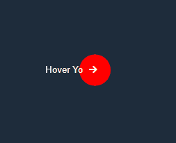

## 15. Gradient Box
- 작성일자 : 2022-05-08
- PR Link : https://github.com/eovhdnjawm1/CSS-Gallery/pull/15
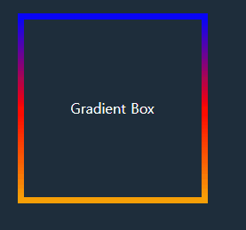


## 16. Change Menu Button Animation
- 작성일자 : 2022-05-09
- PR Link : https://github.com/eovhdnjawm1/CSS-Gallery/pull/16
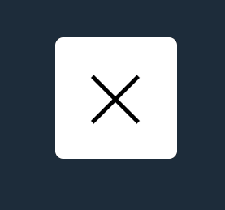

## 17. Neon Sign
- 작성일자 : 2022-05-10
- PR Link : https://github.com/eovhdnjawm1/CSS-Gallery/pull/17
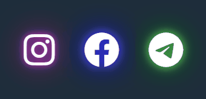

## 18. NeonMovingButton
- 작성일자 : 2022-05-14
- PR Link : https://github.com/eovhdnjawm1/CSS-Gallery/pull/18
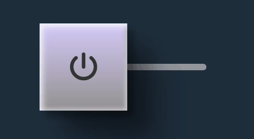

## 19. Pulse Animation
- 작성일자 : 2022-05-15
- PR Link : https://github.com/eovhdnjawm1/CSS-Gallery/pull/19

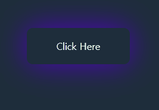


## 20. Text Effect
- 작성일자 : 2022-05-18
- PR Link : https://github.com/eovhdnjawm1/CSS-Gallery/pull/20
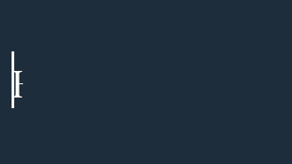

## 21. Text Effect
- 작성일자 : 2022-05-20
- PR Link : https://github.com/eovhdnjawm1/CSS-Gallery/pull/21
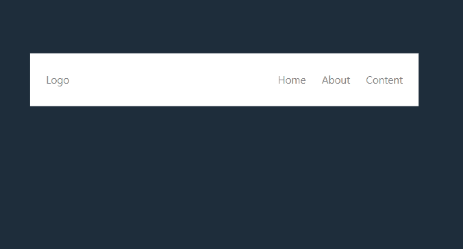

## 22. Focus Blur Event
- 작성일자 : 2022-05-23
- PR Link : https://github.com/eovhdnjawm1/CSS-Gallery/pull/22
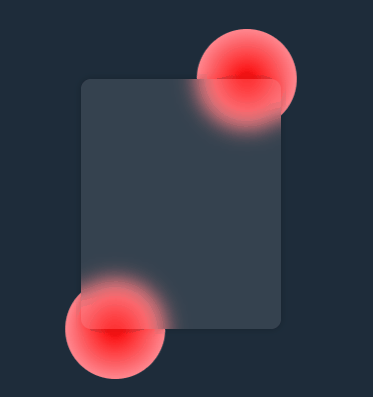


## 23. Focus Blur Event
- 작성일자 : 2022-05-23
- PR Link : https://github.com/eovhdnjawm1/CSS-Gallery/pull/23
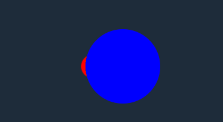

## 24. Focus NavBar
- 작성일자 : 2022-05-25
- PR Link : https://github.com/eovhdnjawm1/CSS-Gallery/pull/24
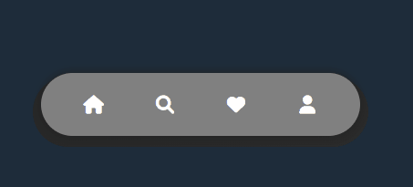

## 25. Shadow Button
- 작성일자 : 2022-05-26
- PR Link : https://github.com/eovhdnjawm1/CSS-Gallery/pull/25
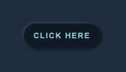

## 26. Neon Loading
- 작성일자 : 2022-05-27
- PR Link : https://github.com/eovhdnjawm1/CSS-Gallery/pull/26
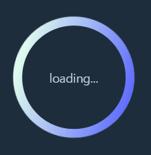

## 27. Bounce Loading
- 작성일자 : 2022-05-30
- PR Link : https://github.com/eovhdnjawm1/CSS-Gallery/pull/27
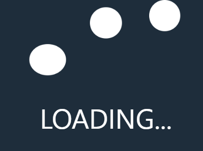

## 28. InteractionNavBar
- 작성일자 : 2022-06-01
- PR Link : https://github.com/eovhdnjawm1/CSS-Gallery/pull/28
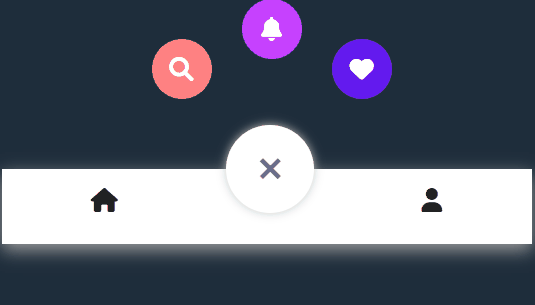

## 리엑트화 작업 일지
### 2022-05-29
메인 페이지에서 이미지를 클릭할 경우 해당 css를 직접 테스트 해볼 수 있는 곳으로 이동하는 작업을 하였음
Parms로 id에 맞는 js 파일을 불러오고 싶었으나 방법을 찾지못함.
json에 있는 id와 별개로 있는 js 파일은 서로 연관성이 없어서 불러올 수 없다고 생각함

### 2022-05-30
App.js에서 css가 통합되어 css 선택자 중복이 이어지므로
css 선택자에 부모요소를 지속적으로 입력하는 모습을 발견하여
Google I/O 에서 발표한 css Scope 기능을 사용해보았으나 적용이 안되는 것을 확인하고 부모요소를 하나씩 입력해주는 방식으로 진행중..

html을 작성하지않고 바로 JSX로 작성하여 css를 추가 작성

### 2022-05-31
기존 html css를 사용할때 
```
class:hover:before{} 
```
해당 형식으로 css 작동을 하였으나 jsx로 html을 구성하고 import로 css를 가져오니
해당 문법이 적용이 안되는 것을 확인하였음
지속적으로 해당 방법을 실패하고 styled components 를 사용하는 방법을 알게되어
styled components로 
```
&:hover:before{}
```
을 사용하였으나 마찬가지로 실패 하였음, 대신 css파일을 추가로 작성하지 않고
styled-components로 작업하여 js 파일 하나로 프로젝트 제작 중

### 2022-06-01
 html 파일 자체를 만들지 않으면서 Interaction Nav 작업
이전에는 html, css 파일로 갤러리를 만들었기 때문에 코드 자동완성이 되었는데
styled-components로 작업하다보니 자동완성이 안뜨는 상황
vscode styled-components 확장프로그램 설치하여 문제해결

aspect-ratio 화면 비율 조절 속성

https://developer.mozilla.org/en-US/docs/Web/CSS/aspect-ratio
참고